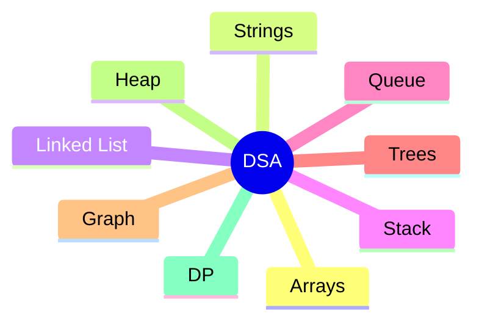

# 🚀 LeetCode Solutions

Welcome to my LeetCode repository!

This repository contains all my solved LeetCode problems.

## Language

- Java

## Platform

- LeetCode

## Goal

- Solve 500+ Problems
- Improve DSA
- Crack Product-Based Companies
# Heading

*Java*

# 🚀 LeetCode Solutions

Welcome

